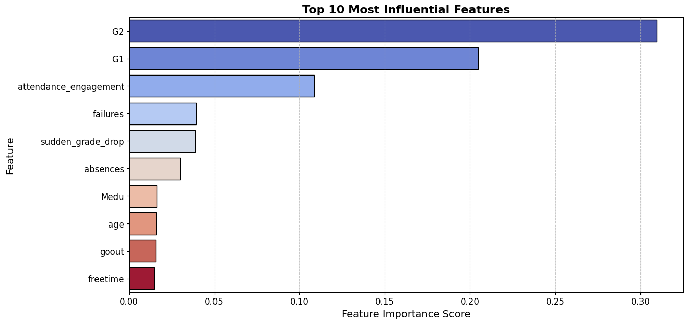
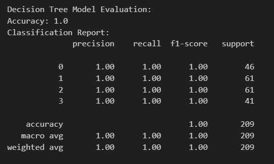

# Early Warning System for At-Risk Students
## Project-4-Group-5

Team Members:
- Victoria Mendez
- Hannah Miles-Kingrey
- Ethan Shipman
- Nathaniel Trief

# Project Overview and Purpose
## Proposal

Our goal is to create an Early Warning System for At-Risk Students. The education dataset[^1] we will be utilizing consists of over 600 individual data instances from two Portuguese Schools including attributes such as student grades, demographics, social, and school related features. The data was collected by using school reports and questionnaires. We’re hoping to identify problem areas within students’ environments and potentially reduce the total drop-out rate.

**Key Questions**
- What impact do certain _social tendencies_ have on the students’ likelihood to succeed? (e.g. Frequency of alcoholic consumption, social lives, extracurricular activities, romantic relationships, etc.)
- Is there a relationship between a student being at-risk and access to _extra educational support_, family educational support, or extra paid classes within the course subject?
- Do students with _higher-educated parents_ perform better in final exams compared to those whose parents have lower levels of education?
- How does _health_ impact a person's likelihood succeed? Does poor health often result in more absences and poorer grades? Is there a high incidence of absence and failure among students classified in poor health? Is there a correlation between health and quality of family relationships?

## Methodology and Tools
- SQLite3, Scikit-learn, Python

### Data Model Implementation
  1. Downloaded and cleaned two CSVs (math student data, Portuguese language student data)
  2. SQLite database creation
  3. Initialize, train, evaluate data model
  4. Make predictions

Top 10 Most Influential Features (to Predict an At-Risk Student)

1. G2 - Second Period Grade
2. G1 - First Period Grade
3. Attendance Engagement (based on absences and grades ratio)
4. Failures count
5. Sudden Grade Drop (from G1 to G2)
6. Absences count
7. Medu (mother's education background)
8. Age
9. goout - Going out with friends rating
10. Freetime after school rating
 
### Data Model Optimization Strategies
  - engineering a variety of features
  - modifying the multilabel classification (based on the final grade, G3)
  - modifying the target (sometimes G3, sometimes 'risk category')
  - experimenting with a variety of model types (logistic regression, random forest, decision tree)

## Results
By creating four risk categories, instead of three, and changing the target to 'risk category' we were able to achieve 99% accuracy with a linear regression model and 100% with a decision tree model.

# Ethical Considerations
This dataset is licensed under a Creative Commons Attribution 4.0 International (CC BY 4.0) license.

# Additional Resources
  
# Attributions
[^1]: [Cortez, P. (2008). Student Performance [Dataset]. UCI Machine Learning Repository. https://doi.org/10.24432/C5TG7T.](https://archive.ics.uci.edu/dataset/320/student+performance)
