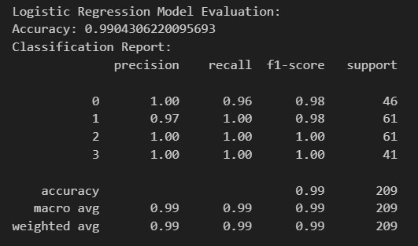

# Early Warning System for At-Risk Students
## Project-4-Group-5

Team Members:
- Victoria Mendez
- Hannah Miles-Kingrey
- Ethan Shipman
- Nathaniel Trief

# Project Overview and Purpose
## Research Question and Terminology

Our goal is to create an Early Warning System for At-Risk Students. The education dataset[^1] we will be utilizing consists of over 600 individual data instances from two Portuguese Schools including attributes such as student grades, demographics, social, and school related features. The data was collected by using school reports and questionnaires. We’re hoping to identify problem areas within students’ environments and potentially reduce the total drop-out rate.

**Key Questions**
- What impact do certain social tendencies have on the students’ likelihood to succeed? (e.g. Frequency of alcoholic consumption, social lives, extracurricular activities, romantic relationships, etc.)
- Is there a relationship between a student being at-risk and access to extra educational support, family educational support, or extra paid classes within the course subject?
- Do students with higher-educated parents perform better in final exams compared to those whose parents have lower levels of education?
- How does health impact a person's likelihood succeed? Does poor health often result in more absences and poorer grades? Is there a high incidence of absence and failure among students classified in poor health? Is there a correlation between health and quality of family relationships?

## Methodology and Tools
- SQLite3, Scikit-learn, Python
- Data Model Implementation
  1. Downloaded and cleaned two CSVs (math student data, Portuguese language student data)
  2. SQLite database creation
  3. Initialize, train, evaluate data model
  4. Make predictions
 
- Data Model Optimization Strategies
  - engineering a variety of features
  - modifying the target (sometimes final grade(G3), sometimes 'risk category)
  - modifying the multilabel classification
  - experimenting with a variety of model types (logistic regression, random forest, decision tree)

## Results
By creating four risk categories, instead of three, we were able to achieve 99% accuracy with a linear regression model and 100% with a decision tree model.

# Ethical Considerations
This dataset is licensed under a Creative Commons Attribution 4.0 International (CC BY 4.0) license.

# Additional Resources
  
# Attributions
[^1]: [Cortez, P. (2008). Student Performance [Dataset]. UCI Machine Learning Repository. https://doi.org/10.24432/C5TG7T.](https://archive.ics.uci.edu/dataset/320/student+performance)
